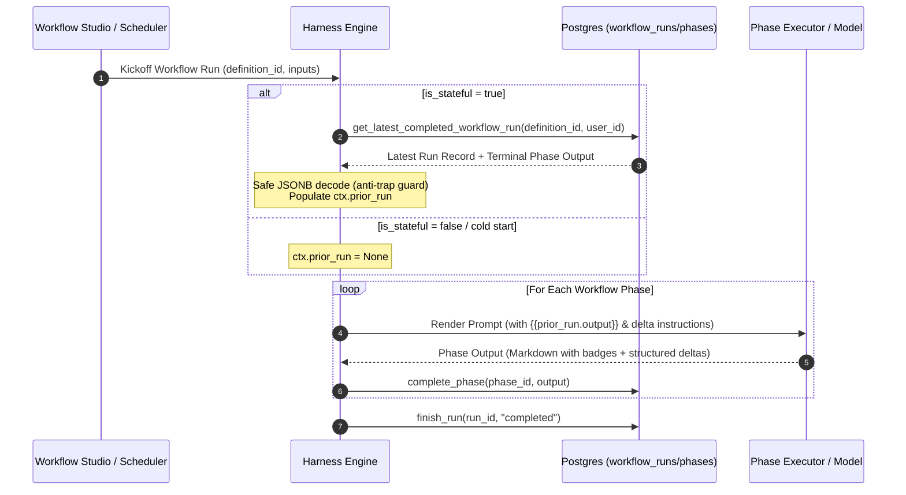

# Phase 205: Stateful & Incremental Workflows - Research

**Researched:** 2026-08-24
**Domain:** Stateful Workflows, Prior Run Memory, Incremental Delta Execution (STATE-01, STATE-02)
**Confidence:** HIGH

<user_constraints>
## User Constraints (from CONTEXT.md)

### Locked Decisions
- **D-01 (Resolution Query):** The previous run baseline is resolved strictly as the most recent `status = 'completed'` run for the exact same published `definition_id` and tenant (`user_id` / `org_id`). Runs with `status` in (`'failed'`, `'cancelled'`, `'active'`) are ignored so that interrupted or broken runs do not corrupt state.
- **D-02 (Cold-Start Initial Baseline):** On the first execution of a stateful workflow (or when no prior completed run exists in the database), `prior_run` resolves to `None` / empty dict. The workflow executes in initialization mode, treating all detected items as baseline / initial entries.
- **D-03 (Template Variable Injection):** The prior run's final deliverable output (from the last phase of the prior completed run) is automatically decoded and exposed as template substitution variables:
  - `{{prior_run.output}}` (full deliverable text/payload)
  - `{{prior_run.id}}` (prior run UUID)
  - `{{prior_run.created_at}}` (timestamp of prior baseline)
- **D-04 (Anti-Trap Defenses & JSONB Safety):** The read path defends against the jsonb string-scalar trap at the point of read (handling both parsed `dict` and json-encoded `str` gracefully), and ensures the write path never double-encodes with `json.dumps` against asyncpg jsonb codecs. Owner scoping is strictly enforced on the service-role pool query (`created_by = $N` or org isolation) to ensure zero cross-tenant leakage.
- **D-05 (Markdown Badges & Structured Deltas):** Living register deliverables format state changes using clear markdown summary sections with standardized status badges:
  - `[NEW]` — newly identified items
  - `[UPDATED]` — existing items with modified status, score, or details
  - `[RESOLVED]` / `[CLOSED]` — items from the previous register that are no longer active
- **D-06 (Machine-Readable Output Schema):** The phase executor optionally emits a structured `deltas` block (`{"added": [...], "modified": [...], "closed": [...], "unchanged": [...]}`) in the phase/run output JSON payload for automated consumption and downstream reporting.
- **D-07 (Workflow-Level Stateful Toggle):** In Workflow Studio, authors can enable "Stateful / Living Register Mode" via a setting on the workflow definition.
- **D-08 (Prompt Editor Variable Chips):** When stateful mode is enabled, `{{prior_run.output}}` appears as a first-class variable insertion chip in the phase prompt template editor.

### Claude's Discretion
- Index design for `workflow_runs(definition_id, user_id, status, created_at DESC)`.
- Helper implementation in `backend/app/db/workflows.py` (`get_latest_completed_workflow_run`).
- Integration into `harness_engine.py` workflow context (`ctx.prior_run`).
- Frontend toggle placement in Workflow Studio settings.

### Deferred Ideas (OUT OF SCOPE)
- Cross-version state tracking across different workflow slugs (candidate for future workflow chaining milestones).
</user_constraints>

<architectural_responsibility_map>
## Architectural Responsibility Map

| Capability | Primary Tier | Secondary Tier | Rationale |
|------------|-------------|----------------|-----------|
| Prior Run Resolution & Query | Database / Storage (`db/workflows.py`) | API / Backend | Owner-scoped query retrieving the latest completed run for `definition_id` |
| Prior State Context Injection | API / Backend (`harness_engine.py`, `phase_types.py`) | Service Role Engine | Loads output, decodes JSONB safely, populates template variables |
| Delta Structure & Badges | Backend (`phase_types.py`) / LLM Prompt Framing | Final Deliverable | Guides LLM to structure outputs with standard `[NEW]`, `[UPDATED]`, `[RESOLVED]` badges |
| Authoring Toggle & Variable Chips | Browser / Frontend Client (`WorkflowSettingsSheet.tsx`, `PromptEditor`) | Backend Schema (`harness.py`) | Allows authors to toggle statefulness and insert `{{prior_run.output}}` chips |
</architectural_responsibility_map>

<research_summary>
## Summary

Phase 205 empowers workflows to maintain continuous state across successive runs without re-reporting redundant baseline facts or requiring human operators to manually compute diffs. When configured with `is_stateful: true`, each run automatically resolves its previous completed execution for the same workflow definition and owner, loading that run's terminal deliverable.

The technical design addresses four key requirements:
1. **Durable, Fast, Owner-Scoped Resolution**: A lightweight query against `workflow_runs` + `workflow_phases` finds the most recent `completed` run for `(definition_id, user_id, org_id)`.
2. **Defensive JSONB Hydration**: Protecting against asyncpg string-scalar traps by ensuring output dictionaries are parsed safely (`isinstance(raw, dict)` or `json.loads(raw)` fallback) at the read boundary.
3. **Template & Prompt Context Interpolation**: Automatically making `{{prior_run.output}}`, `{{prior_run.id}}`, and `{{prior_run.created_at}}` available in phase prompt templates.
4. **Structured Delta Conventions (STATE-02)**: Standardizing markdown badges (`[NEW]`, `[UPDATED]`, `[RESOLVED]`) and structured output payload schemas for living registers (e.g. risk registers, security compliance audits).

**Primary recommendation:** Implement Phase 205 as a single cohesive plan (`205-01-PLAN.md`) that touches DB query resolution, `harness_engine` context loading, `phase_types` prompt formatting, and Workflow Studio settings in one verified transaction.
</research_summary>

<architecture_patterns>
## Architecture Patterns

### Data Flow Diagram



### Database Query Pattern

```python
async def get_latest_completed_workflow_run(
    pool: asyncpg.Pool,
    definition_id: UUID,
    *,
    user_id: UUID,
    org_id: UUID | None = None,
) -> dict | None:
    """Owner-scoped resolution of the most recent completed run for a workflow definition.

    Returns dict with run metadata and final deliverable output, or None if no prior
    completed run exists (cold start).
    """
    row = await pool.fetchrow(
        """
        SELECT wr.id AS run_id, wr.created_at, wp.output AS final_output
        FROM workflow_runs wr
        JOIN threads t ON t.id = wr.thread_id
        LEFT JOIN LATERAL (
            SELECT output
            FROM workflow_phases
            WHERE workflow_run_id = wr.id AND status = 'completed'
            ORDER BY created_at DESC
            LIMIT 1
        ) wp ON true
        WHERE wr.definition_id = $1
          AND t.user_id = $2
          AND ($3::uuid IS NULL OR wr.org_id = $3)
          AND wr.status = 'completed'
        ORDER BY wr.created_at DESC
        LIMIT 1
        """,
        definition_id,
        user_id,
        org_id,
    )
    if row is None:
        return None
    
    raw_output = row["final_output"]
    if isinstance(raw_output, str):
        try:
            parsed_output = json.loads(raw_output)
        except Exception:
            parsed_output = {"text": raw_output}
    elif isinstance(raw_output, dict):
        parsed_output = raw_output
    else:
        parsed_output = {}

    return {
        "run_id": str(row["run_id"]),
        "created_at": row["created_at"].isoformat() if row["created_at"] else None,
        "output": parsed_output,
    }
```

</architecture_patterns>

<validation_architecture>
## Validation Architecture

### Automated Verification Strategy
1. **Unit Tests (`backend/tests/unit/test_stateful_workflows.py`)**:
   - Query resolution: verifies `get_latest_completed_workflow_run` returns most recent completed run.
   - Isolation fence: verifies runs belonging to another `user_id` or `org_id` are never returned.
   - Cold start: verifies first run returns `None` without errors.
   - Fault tolerance: verifies `failed` and `cancelled` runs are excluded from state resolution.
   - JSONB string-scalar defense: verifies both `str` and `dict` outputs are parsed safely.
   - Template variable interpolation: verifies `{{prior_run.output}}` is replaced in phase prompts.
2. **Frontend Unit Tests (`frontend/src/components/workflows/builder/WorkflowSettings.test.tsx`)**:
   - Verifies `is_stateful` toggle persists in `WorkflowDefinition`.
   - Verifies `{{prior_run.output}}` variable chips render when stateful mode is enabled.
</validation_architecture>
